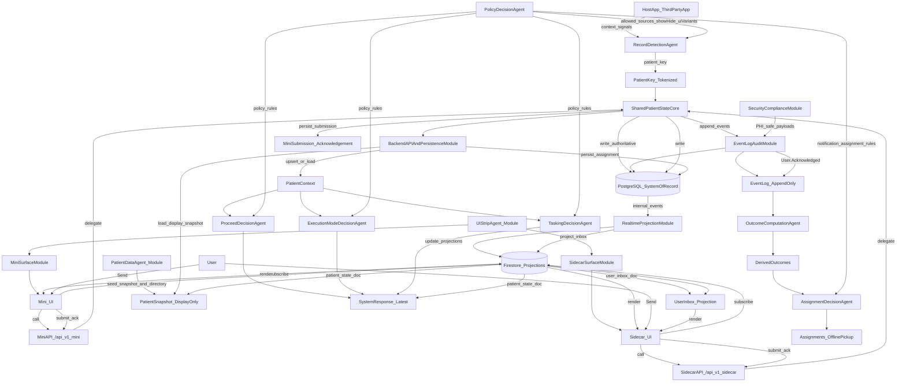

## Mobius Mini + Sidecar (Phase 1) — Relationship Map (Visual)

- **PRD**: `PRDs/mobius_mini_sidecar_phase_1_prd.md`
- **Companion mapping**: `PRDs/mobius_mini_sidecar_phase_1_agent_map.md`

### System directory (agents vs modules)

### How to read this
- **Decision agents** produce computed decisions: `patient_key`, proceed, mode, tasking, outcomes, assignments.
- **Modules** provide execution: UI rendering, API/persistence, event log, realtime projections, PHI-safe enforcement.
- **Mini + Sidecar** use **separate surface paths** (`/api/v1/mini/*` and `/api/v1/sidecar/*`) that delegate to the same `SharedPatientStateCore`, so they remain two views over the same underlying patient state (authoritative in PostgreSQL; projected in Firestore; audited via append-only event log).

